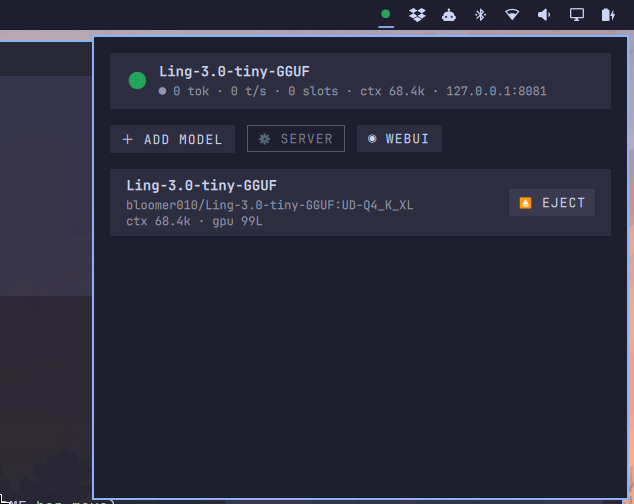

# llamacpp-loader



An [Omarchy](https://omarchy.org/) shell plugin for loading openweight LLMs on a
local [llama-server](https://github.com/ggml-org/llama.cpp). It adds a bar
status icon and a model-library panel.

- **Bar icon** has two states: unloaded (dim `○`) and loaded (accent `●`).
  Hovering shows a tooltip with the loaded model name, context size, and live
  usage (tokens and active slots).
- **Click** opens the panel: the list of saved models, per-model *Load* /
  *Eject* / *Edit*, and an **Add model** field where you paste a Hugging Face
  GGUF reference exactly as you would to `llama-server`.

## Features

- One `llama-server` process per loaded model, launched fully detached so it
  **survives the Omarchy shell / plugin being restarted or killed**.
- **Launch phases** are tracked and shown: `○` unloaded · `◌` starting ·
  `⤓` downloading (with a live **download %** when the model isn't cached) ·
  `●` serving.
- Context size, GPU-offloaded layers, MoE offload, and **arbitrary llama-server
  args** are tunable **per model**, and are re-used on every load until edited.
- A **server config** block lets you change the host/port and pass through
  global default args (e.g. `--no-mmap`, `--load-mode none`).
- The plugin owns the model library + "loaded" marker in its own state file.
- On startup it **reconciles** with the running server's HTTP API (`/health`,
  `/metrics`, `/slots`) on the remembered port, so the icon is correct after the
  shell restarts — the server's own API is the source of truth, not the plugin.

## Install

A plugin is a git repo with `manifest.json` at its root. Add it by repo or by
hand:

```bash
omarchy plugin add https://github.com/nunodonato/llamacpp-loader.git --enable --yes
# or, hand install:
mkdir -p ~/.config/omarchy/plugins/io.github.nunodonato.llamacpp-loader
cp manifest.json llama.py Model.js BarWidget.qml Panel.qml ~/.config/omarchy/plugins/io.github.nunodonato.llamacpp-loader/
omarchy-shell shell rescanPlugins
```

Then add it to your bar in `~/.config/omarchy/shell.json` (it appears in
`bar.layout.*`; the plugin ships a `defaultSection` of `right`). Move it with:

```bash
omarchy bar move io.github.nunodonato.llamacpp-loader --section right
```

Saving a file under `~/.config/omarchy/plugins/` hot-reloads; force with
`omarchy-shell shell rescanPlugins`.

## Adding a model

Open the panel and click **Add model**. Paste a HF reference:

```
Qwen/Qwen2.5-7B-Instruct-GGUF                → default quant (Q4_K_M)
Qwen/Qwen2.5-7B-Instruct-GGUF:Q5_K_M         → explicit quant
https://huggingface.co/<repo>/blob/main/<file>.gguf → specific file
```

The add form also takes optional **ctx / gpu layers / moe cpu** values. These are
saved on the model and re-used on every subsequent load — change them later from
that model's **Edit**.

## Per-model settings (Edit)

| Field | `llama-server` flag | Default |
|-------|---------------------|---------|
| ctx size | `--ctx-size` | 8192 |
| gpu layers (offloaded) | `-ngl` | 99 |
| moe cpu layers (MoE expert weights on CPU) | `--n-cpu-moe` | 0 |
| keep all MoE on CPU | `--cpu-moe` | off |
| extra args (this model only) | appended to the argv | — |

Example: `--parallel 2 --flash-attn on`.

> Note: this llama.cpp build exposes MoE offload as `--n-cpu-moe` / `--cpu-moe`
> rather than the older `--n-gpu-layers-moe`. The flag choice lives in one place
> (`llama.py build_server_args`) so it can be updated for the build in use.

## Server config

Click **⚙ Server** in the panel to set `host`, `port`, and **extra args** that
are prepended to every launch. This is where you'd disable mmap, force a load
mode, or change the port:

```json
{ "host": "127.0.0.1", "port": 7891, "extraArgs": ["--no-mmap", "--load-mode", "none"] }
```

Global `server.extraArgs` come before the per-model `model.extraArgs`, so a
per-model tweak wins on an overlapping flag.

## How state is tracked after the shell dies

1. `llama.py load` builds the `llama-server` argv and launches it with
   `start_new_session=True` (detached, reparented to init/systemd), so it is not
   a child of the shell. The pid, port, and argv are written to the state file.
2. On boot, `BarWidget.qml` reads the state file (`llama.py status`) and probes
   the saved port with `/health` (+ `/metrics`, `/slots` when metrics are on).
3. If the server answers, the icon shows **serving**; if not it classifies the
   launch phase from `llama.py progress` — **downloading** (watching the growing
   `.downloadInProgress` file in the HF cache vs the model's size from the HF
   API), **starting**, or **crashed**. It never auto-starts a model on boot.

State file: `~/.local/state/omarchy/llama/state.json`
Server log:  `~/.local/state/omarchy/llama/llama-server.log`

**Eject safety:** `llama.py eject` reads the recorded pid, verifies `/proc/<pid>/cmdline`
still carries our `--port` + model markers (so a recycled pid is never killed),
then SIGTERMs and waits for a graceful exit.

## CLI

```bash
python3 llama.py add --json '{"id":"qwen","hfRepo":"Qwen/Qwen2.5-7B-Instruct-GGUF","hfFile":"qwen2.5-7b-instruct-q4_k_m.gguf","ctxSize":8192,"nGpuLayers":99,"extraArgs":"--parallel 2"}'
python3 llama.py config --json '{"port":7891,"extraArgs":"--no-mmap --load-mode none"}'   # + host
python3 llama.py build --model-id qwen --metrics on   # print argv
python3 llama.py load --model-id qwen --dry-run       # print argv without launching
python3 llama.py load --model-id qwen
python3 llama.py progress                             # unloaded/downloading/starting/crashed
python3 llama.py status
python3 llama.py eject
```

## Tests

Pure helpers are unit-tested with node. Run:

```bash
node test/model-test.js
python3 -c "import ast; ast.parse(open('llama.py').read()); print('llama.py OK')"
```

## Layout

```
manifest.json    # kind: bar-widget, schema for host/port/metrics/pollInterval
BarWidget.qml    # status icon (unloaded/starting/downloading/serving), tooltip,
                 # poll timer, launch-phase tracking, boot reconcile, panel host
Panel.qml        # model list, load/eject/edit, add-by-HF-paste, server config, usage
Model.js         # pure helpers (parseHfRef, clamps, /metrics and /slots parsers)
llama.py         # sidecar: detached launch, safe eject, download progress,
                 # server config, state/persistence
README.md
```

